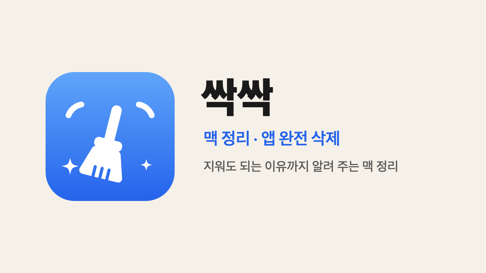

<p align="center"></p>

# 🧹 싹싹 (SsakSsak) — 지워도 되는 이유까지 알려 주는 맥 정리

**캐시 · 로그 · 개발 도구 찌꺼기부터 앱의 남은 파일, 숨어 있는 큰 파일까지.**
항목마다 지워도 되는 이유와 위험도를 보여 주고, 모두 휴지통을 거쳐 정리해요.

- ⬇️ **다운로드 (애플 공증):** [최신 릴리스](https://github.com/hanseolhui/ssakssak/releases/latest) · `brew install --cask hanseolhui/tap/ssakssak`
- 소개 · Pro: [apps.seoriarts.com/ssakssak](https://apps.seoriarts.com/ssakssak)
- 유니버설 (애플 실리콘 + 인텔) · macOS 13 이상

## 🚀 설치

**방법 1. 다운로드** — [최신 릴리스](https://github.com/hanseolhui/ssakssak/releases/latest)에서 `SsakSsak.zip` 받기 → 압축 풀고 `SsakSsak.app`을 **응용 프로그램** 폴더로 옮긴 뒤 실행

**방법 2. Homebrew**

```bash
brew install --cask hanseolhui/tap/ssakssak
```

**방법 3. 터미널 한 줄**

```bash
bash -c "$(curl -fsSL https://raw.githubusercontent.com/hanseolhui/ssakssak/main/install.sh)"
```

**처음 한 번: 전체 디스크 접근 허용 (권장)**
시스템 설정 → 개인정보 보호 및 보안 → **전체 디스크 접근** → SsakSsak 켜기.
없어도 쓸 수 있지만, 앱의 남은 파일 · 휴지통 크기 · 메일 첨부 사본을 놓칠 수 있어요.

## 🧹 할 수 있는 것

| | 무료 · Pro |
|---|---|
| 시스템 정크 — 앱 캐시 · 로그 · 업데이트 찌꺼기 · 개발 도구(Xcode · npm · Gradle · Homebrew …) | 무료 |
| 숨어 있는 큰 파일 — iPhone 업데이트 파일 · 메일 첨부 사본 · macOS 설치 앱 · 오래된 node_modules · 오래 안 연 다운로드와 스크린샷 | 무료 |
| 앱 완전 삭제 · 반년 넘게 안 연 앱 · 자동 실행 점검과 끄기 | 무료 |
| 용량 지도 · 큰 파일 (크기순 · 오래 안 쓴 순) · 시스템 데이터 · Time Machine 로컬 스냅샷 | 무료 |
| 메모리 — '메모리 비우기' 대신 압력 · 스왑 · 누가 쓰는지 | 무료 |
| 휴지통 감시 · 정리 알림 · 지운 앱의 남은 파일 · 같은 파일 찾기 · 여러 앱 한꺼번에 지우기 | Pro (각각 3번 체험) |

## 안전하게

- **바로 지우는 길이 없어요.** 모든 정리는 휴지통을 거치고, 영구 삭제는 직접 '휴지통 비우기'를 누를 때만.
- 기본으로 고르는 건 **앱이 다시 만드는 것**뿐. AI 모델 · 시뮬레이터 · 백업 · 사람이 받은 파일은 보여만 주고 꺼 둬요.
- macOS 시스템 파일 · 키체인 · 메일 · 메시지 · 사진 보관함 · iCloud 폴더는 목록에 올라오지 않게 막아요.
- 인터넷은 업데이트 확인 · 라이선스 확인 · 직접 보내는 의견에만 써요.

## 🗑 삭제

싹싹 → 설정 맨 아래 **싹싹 지우기** (앱과 설정 · 기록 · 로그를 휴지통으로). Homebrew: `brew uninstall --cask ssakssak`
